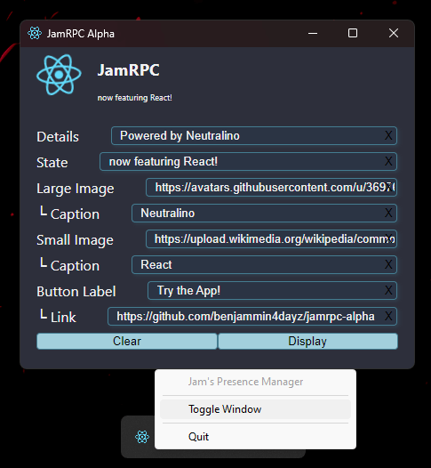

# JamRPC

This is a small desktop app which allows you to display rich presence on Discord.

Built using Neutralino, React, and Node.js, some features include:

- Continuously display rich presence.
- Hide the window in the system tray.
- Cross-platform (probably™).

Over time, I hope to expand these features with a drop-in module system to support different games or special activities. For example, a countdown to a special occasion, or the current score of your favorite sports match!

> [!Warning]  
> **Work in Progress** - features and bugs may appear or disappear at random. Check back often!

## 🧑‍💻 Setup Instructions

1.  #### Install the App

    Download the [latest release](https://github.com/benjammin4dayz/jamrpc-alpha/releases/latest) and extract it anywhere.

2.  #### Get Node.js

    Download a portable Node.js **binary** from [nodejs.org](https://nodejs.org/en/download/)

    - [v20.11.1 - Windows x64](https://nodejs.org/dist/v20.11.1/node-v20.11.1-win-x64.zip)

3.  #### Configure the App

    Drag and drop `node.exe` into the App's `extensions/` folder.

> [!NOTE]  
> This app expects a `node` executable inside the `extensions/` folder. Global installs are not supported at this time.

## 👥 Acknowledgements

| Name             | Reason                                                  | Links                                                                                                                                                                                                                                                                                                                                                                                                                                                                                                                                                        |
| ---------------- | ------------------------------------------------------- | ------------------------------------------------------------------------------------------------------------------------------------------------------------------------------------------------------------------------------------------------------------------------------------------------------------------------------------------------------------------------------------------------------------------------------------------------------------------------------------------------------------------------------------------------------------ |
| Discord          | This project wouldn't exist without it                  | <a href="https://discord.gg/" title="App Website"></img></a>                                                                                                                                                                                                                                                                                                   |
| Neutralino.js    | A delightfully **tiny** framework for building web apps | <a href="https://neutralino.js.org/" title="Project Website"></img></a> <a href="https://github.com/neutralinojs/neutralinojs" title="Project Source"></img></a>     |
| Harald Schneider | Node IPC (backend) extension for Neutralino             | <a href="https://marketmix.com" title="Developer Website"></img></a> <a href="https://github.com/hschneider/neutralino-ext-node" title="Extension Source"></img></a> |

---

### ✏️ Notes

Development

### Requirements:

[Node.js v20+](https://nodejs.org)

### Commands

1.  Prepare dependencies

        npm i -g @neutralinojs/neu && npm install

2.  Start the dev server

        npm run start

3.  Build the app

        npm run build

4.  Tidy up afterwards

        npm run clean

---
